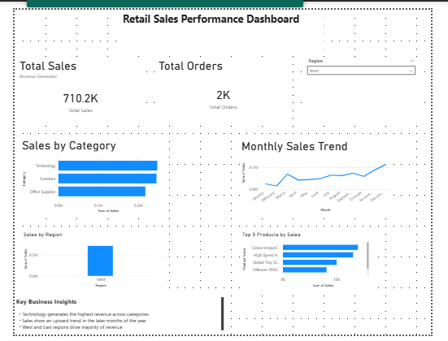

# Retail Sales Performance Dashboard (Power BI)

## Project Overview
This project analyzes retail sales performance using Power BI. The dashboard provides insights into revenue trends, regional performance and top-selling products.
The dashboard enables users to monitor key metrics such as total revenue, order volume and product performance.

## Tools Used
- Power BI
- DAX
- Data Modeling
- Data Visualization
- Excel/CSV Dataset

## Dataset
The dataset contains retail transaction data including:
- Order ID
- Order Date
- Sales
- Product Category
- Product Name
- Region

The dataset contains over 5,000 transactions used to analyze revenue trends and product performance.

## Key Features
- KPI cards (Total sales & Total Orders)
- Monthly Sales Trend Analysis
- Sales by Category
- Sales by Region
- Top 5 Products by Sales
- Interactive Region Filter

## Key Insights
- Technology generates the highest revenue across categories
- West and east regions drive the majority of revenue
- Revenue is concentrated among a small nmber of products

## Dashboard Preview

Interactive Power BI dashboard analysing retail sales performance across categories, regions and product segments.

